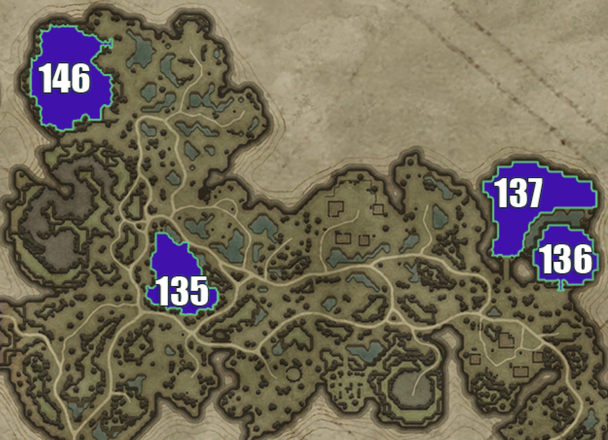

## Cursed Forest

Living here is a pain because you have to keep swapping capes. It's also almost impossible to live without being gear 50 or higher because of the high level mobs and the curse. With that said, it's a good location for fighting and farming in Ruins of Mortium.

> Individual plot images below are from: https://www.cadrift.net/v-rising/territories/

## Plot 135

- too open
- can bat land on the rock ledge on the east then jump on the castle if you have a balcony

## Plot 136

- narrow stairs entrance
- 10-doors deep
- jumpable: Plot 137
- can bat land on the edges of the plot near the stairs

## Plot 137

- bridge entrance
- 18-doors deep from bridge
- 12-doors deep from the south side
- 14-doors deep from the west side
- can leap into plot via Plot 136 if you have a balcony
- can jump on the whole south side of the plot
- can jump from the opposite side of the cliff on the west side into the plot

## Plot 146

- narrow stairs entrance in northeast
- half stairs entrance in southeast
- 16-doors deep from northeast
- 17-doors deep from southeast
- can frog jump on the east edges of the plot
- can bat land at the west edges of the plot
- can jump on various edges at the west of the plot

## Plot Directory

- [Terms](../146-plots-analysis.md#terms)
- [Go here for plots in Farbane West](farbane-west.md)
- [Go here for plots in Farbane East](farbane-east.md)
- [Go here for plots in Dunley Farmlands](dunley.md)
- [Go here for plots in Hallowed Mountains](hallowed.md)
- [Go here for plots in Silverlight Hills](silverlight.md)
- [Go here for plots in Cursed Forest](cursed.md)
- [Go here for plots in Gloomrot](gloomrot.md)
- [Go here for plots in Oakveil](oakveil.md)

---

[Back to Home](../../README.md)
