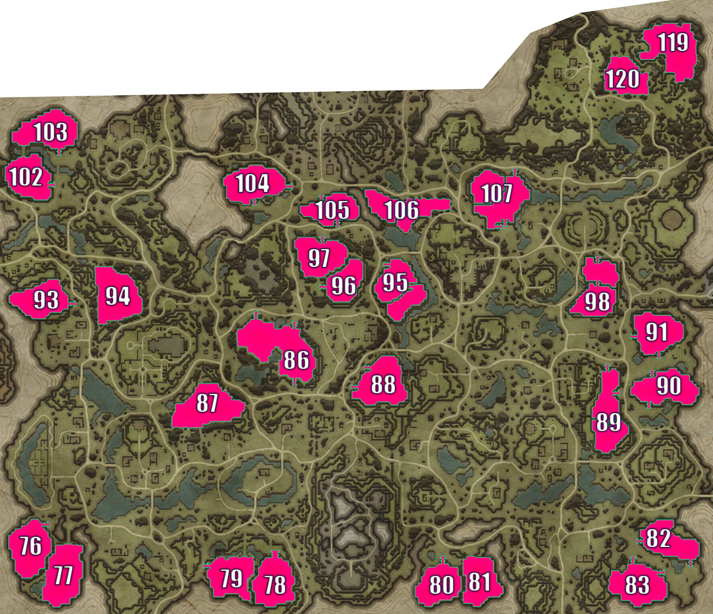

## Dunley Farmlands

> Individual plot images below are from: https://www.cadrift.net/v-rising/territories/

## Plot 76

- narrow stairs entrance
- 20-doors deep
- 7-doors deep from Plot 77
- jumpable: Plot 77

## Plot 77

- bridge entrance in north
- whole west side is open
- 16-doors deep from north
- 13-doors deep from west
- can leap from the other side of the cliff in the east but the important one is blockable using stairs
- jumpable: Plot 76
- pair with Plot 76

## Plot 78

- wide stairs entrance
- 14-doors deep
- 7-doors deep from Plot 79
- can bat land on southeast corner
- jumpable: Plot 79

## Plot 79

- bridge entrance in north
- narrow stairs entrance in northwest
- whole east side is open
- lots of edges and corners in the plot can be jumped
- 13-doors deep from north
- 9-doors deep from northwest
- 11-doors deep from east
- jumpable: Plot 78

## Plot 80

- narrow stairs entrance
- 14-doors deep
- 15-doors deep from Plot 81
- jumpable: Plot 81

## Plot 81

- north is open
- west is open
- 12-doors deep from north
- 10-doors deep from west
- can leap from the other side of the cliff on the east
- jumpable: Plot 80

## Plot 82

- narrow stairs entrance in west
- narrow stairs entrance in southeast
- 8-doors deep from west
- 13-doors deep from southeast
- 99% secure
- pair with Plot 83

## Plot 83

- narrow stairs entrance in north
- narrow stairs entrance in northeast
- 9-doors deep from north
- 11-doors deep from northeast
- can bat land on the mountains in the west, can jump to 1st and 2nd level
- pair with Plot 82

## Plot 86[^1]

- narrow stairs entrance in northeast
- narrow stairs entrance in northwest
- narrow stairs entrance in southeast
- 11-doors deep from northeast
- 11-doors deep from northwest
- 8-doors deep from southeast
- can bat land on lots of corner
- great plot to speedrun Dunley

## Plot 87

- too open
- can bat land on most rocks surrounding the plot then jump if you have a balcony

## Plot 88[^1]

- narrow stairs entrance in southwest
- narrow stairs entrance in west
- 16-doors deep from southwest
- 17-doors deep from west
- 99% secure

## Plot 89

- narrow stairs entrance in the north
- narrow stairs entrance in the east
- 24-doors deep from north
- 21-doors deep from east
- can place servants to cover all entrances
- can bat land on the waterfall on the southwest
- can jump down from plateau on the northwest

## Plot 90[^1]

- narrow stairs entrance in north
- narrow stairs entrance in south
- servants can be placed to cover all entrances
- 15-doors deep from north
- 16-doors deep from north
- 99% secure

## Plot 91[^1]

- narrow stairs entrance in west
- narrow stairs entrance in south
- 15-doors deep from west
- 13-doors deep from south
- 99% secure

## Plot 93[^1]

- open area in northeast
- narrow stairs entrance in southeast
- 19-doors deep from northeast
- 17-doors deep from southeast
- can bat land on the mountains in the north then leap to the plot

## Plot 94

- too open
- can bat land on most rocks surrounding the plot then jump if you have a balcony

## Plot 95

- THE GOAT.
- narrow stairs entrance
- 32-doors deep
- 99% secure

## Plot 96[^1]

- narrow stairs entrance
- 16-doors deep
- 3-doors deep from Plot 97
- jumpable: Plot 97

## Plot 97[^1]

- narrow stairs entrance in north
- open area in south
- 10-doors deep from north
- 11-doors deep from south
- jumpable: Plot 96

## Plot 98

- narrow stairs entrance
- 20-doors deep
- 99% secure

## Plot 102[^1]

- narrow stairs entrance in east
- bridge entrance in northwest via plot 103
- 15-doors deep from east
- 7-doors deep from bridge
- can jump to plot from bridge in the east
- pair with Plot 103

## Plot 103[^1]

- narrow stairs entrance in southeast
- bridge entrance in southwest via plot 102
- 10-doors deep from southeast
- 19-doors deep from bridge
- pair with Plot 102
- 99% secure

## Plot 104[^1]

- narrow stairs entrance in east
- narrow stairs entrance in south
- 19-doors deep from east
- 13-doors deep from south
- can bat land on the mountain in the south

## Plot 105[^1]

- narrow stairs entrance at north
- narrow stairs entrance at south
- can place servants to cover all entrances
- 7-doors deep from north
- 9-doors deep from south
- can leap into plot via Plot 106

## Plot 106[^1]

- narrow stairs entrance if you start at 2nd level
- 13-doors deep
- 4-doors deep from Plot 105
- can leap into plot via Plot 105

## Plot 107

- narrow stairs entrance if you start at 2nd level
- 8-doors deep
- 99% secure

## Plot 119[^1]

- half-stairs entrance in south
- half-stairs entrance in west
- 15-doors deep from south
- 18-doors deep from west
- can bat land on the north and east side of the plot
- can jump to a lot of corners of the plot

## Plot 120

- too open
- can jump from the ledges below plot 119

## Plot Directory

- [Terms](../146-plots-analysis.md#terms)
- [Go here for plots in Farbane West](farbane-west.md)
- [Go here for plots in Farbane East](farbane-east.md)
- [Go here for plots in Dunley Farmlands](dunley.md)
- [Go here for plots in Hallowed Mountains](hallowed.md)
- [Go here for plots in Silverlight Hills](silverlight.md)
- [Go here for plots in Cursed Forest](cursed.md)
- [Go here for plots in Gloomrot](gloomrot.md)
- [Go here for plots in Oakveil](oakveil.md)

[^1]: castle depth is estimated. It usually goes down by 2-5 after adding banshees room and servants room.

---

[Back to Home](../../README.md)
