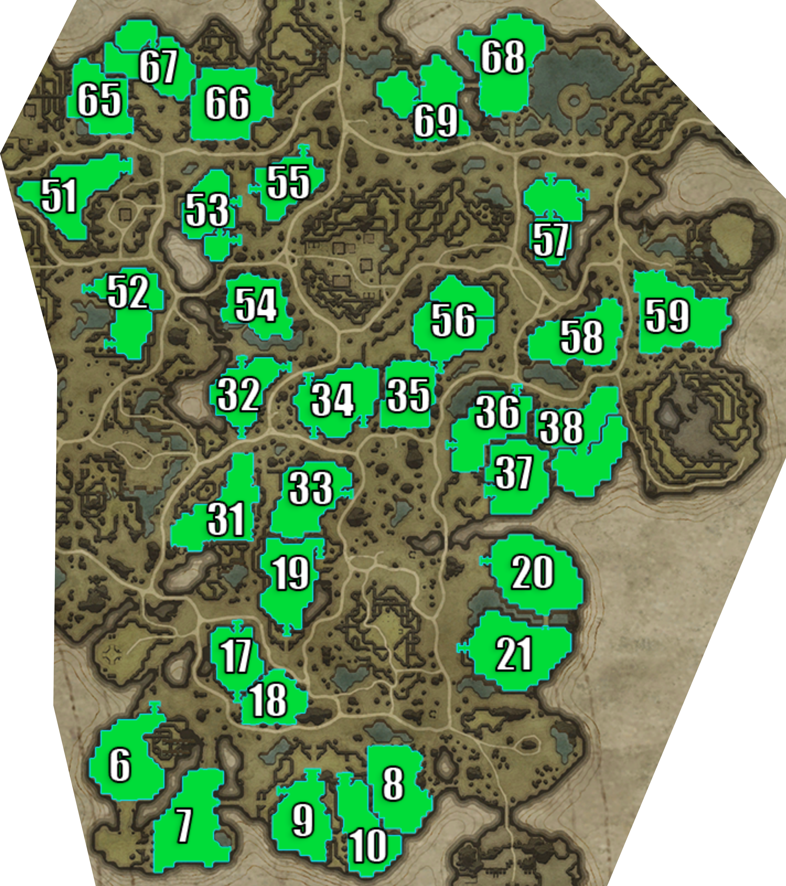

## Farbane East

> Individual plot images below are from: https://www.cadrift.net/v-rising/territories/

## Plot 6[^1]

- narrow stairs entrance
- south side is open
- 19-doors deep from the north
- 7-doors deep from the back
- pair with Plot 7

## Plot 7[^1]

- wide north area followed by a bridge creating a natural funnel
- west side is open
- east entrance can be blocked by stairs
- 19-doors deep from the north
- 7-doors deep from the west
- 6-doors deep from east (requires breach)
- pair with Plot 6

## Plot 8

- too open
- jumpable: Plot 10

## Plot 9[^1]

- wide stairs entrance in north
- narrow stairs entrance in west
- east side is open to Plot 10
- servants can be placed to cover north and west entrances
- 12-doors deep from the north
- 8-doors deep from Plot 10
- 7-doors deep from the half ledge in the west
- jumpable: Plot 10
- pair with Plot 10
- can jump on the half ledge in the west

## Plot 10[^1]

- wide north entrance
- west side is open
- 15-doors deep from the north
- 9-doors deep from Plot 9
- 3-doors deep from Plot 8
- jumpable: Plot 8 and Plot 9
- pair with Plot 9

## Plot 17[^1]

- narrow stairs entrance in north
- narrow stairs entrance in south
- 5-doors deep from north
- 6-doors deep from south
- 9-doors deep from Plot 18
- jumpable: Plot 18

## Plot 18

- too open
- jumpable: Plot 17

## Plot 19[^1]

- narrow stairs entrance in northeast
- narrow stairs entrance in south
- 9-doors deep from northeast
- 9-doors deep from south
- 9-doors deep from Plot 33
- jumpable: Plot 33

## Plot 20[^1]

- narrow stairs entrance in west
- narrow bridge entrance in southeast
- 21-doors deep from west
- 7-doors deep from southeast bridge
- pair with Plot 21
- jumping from bridge can reach 2nd floor

## Plot 21[^1]

- narrow stairs entrance in west
- narrow bridge entrance in northeast
- 22-doors deep from west
- 8-doors deep from northeast bridge
- pair with Plot 20
- jumping from bridge can reach 2nd floor

## Plot 31

- too open
- surrounded by elevations that can be used to jump into the 2nd level of the castle

## Plot 32[^1]

- narrow stairs entrance in north
- narrow stairs entrance in northeast
- servants can be placed to cover the north and northeast entrances
- narrow stairs entrance in south
- 7-doors deep from north
- 13-doors deep from northeast
- 8-doors deep from south
- can jump from plateau on southwest

## Plot 33[^1]

- narrow stairs entrance in east
- half stairs entrance in west
- 9-doors deep from east
- 9-doors deep from west
- 5-doors deep from northeast corner
- can horse jump from northeast of Plot 19
- can jump from southwest half-stairs
- can bat land to the southern edges of the plot
- jumpable: Plot 19

## Plot 34

- too open
- jumpable: Plot 35

## Plot 35

- too open
- jumpable: Plot 34 and Plot 56

## Plot 36[^1]

- narrow stairs entrance in north
- narrow stairs entrance in southwest
- wide half-stairs entrance in south
- 6 doors from Castle Heart from east
- jumpable: Plot 37 and Plot 38

## Plot 37[^1]

- wide stairs entrance
- 12-doors deep
- 6-doors deep from Plot 36
- 2-doors deep from Plot 38
- jumpable: Plot 36 and Plot 38

## Plot 38[^1]

- wide stairs entrance if defense starts at the 2nd level
- 13-doors deep
- jumpable: Plot 36 and Plot 37
- can bat land on east edges of the plot

## Plot 51[^1]

- wide stairs entrance
- 19-doors deep
- 5-doors deep from backdoor
- can jump from the plateau below nicholaus
- great temporary plot to watch over Quincey and farm whetstones

## Plot 52[^1]

- narrow stairs entrance in southwest
- narrow stairs entrance in northwest
- 15-doors deep from southwest
- 10-doors deep from northwest
- 99% secure

## Plot 53[^1]

- narrow stairs entrance in east
- narrow stairs entrance in southeast
- can place servants to cover all entrances
- 10-doors deep from east
- 7-doors deep from southeast
- can leap from Plot 55

## Plot 54

- too open
- great temporary plot to unlock Keely, make leather armor, and buy books

## Plot 55[^1]

- narrow stairs entrance in north
- narrow stairs entrance in west
- 5-doors deep from north
- 6-doors deep from west
- can leap from Plot 53

## Plot 56[^1]

- narrow stairs entrance in south
- half stairs entrance in west
- can place servants to cover all entrances
- 21-doors deep from south
- 19-doors deep from west
- sunbase
  - wide stairs entrance
  - 10-doors deep
  - 3-doors deep via frog jump backdoor
- jumpable: Plot 35
- can bat land on the northeast area of the plot
- great starter plot to unlock keely, make leather armor, buy books, and kill Kodia

## Plot 57[^1]

- narrow stairs entrance in north
- narrow stairs entrance in east
- can place servants to cover all entrances
- 15-doors deep from north
- 17-doors deep from east
- 99% secure

## Plot 58

- too open

## Plot 59

- too open
- can jump from the other side of the crevice

## Plot 65

- too open
- can use the surrounding rocks to jump over the 2nd level if you have a balcony
- jumpable: Plot 67

## Plot 66

- too open
- can jump to balcony from the rock ledge at north, northeast and southeast
- jumpable: Plot 67

## Plot 67

- half stairs entrance
- 16-doors deep
- can bat land on the mountains in the east
- jumpable: Plot 65 and 66

## Plot 68

- too open

## Plot 69[^1]

- narrow stairs entrance if defense starts at 2nd level
- 5-doors deep
- 99% secure

## Plot Directory

- [Terms](../146-plots-analysis.md#terms)
- [Go here for plots in Farbane West](farbane-west.md)
- [Go here for plots in Farbane East](farbane-east.md)
- [Go here for plots in Dunley Farmlands](dunley.md)
- [Go here for plots in Hallowed Mountains](hallowed.md)
- [Go here for plots in Silverlight Hills](silverlight.md)
- [Go here for plots in Cursed Forest](cursed.md)
- [Go here for plots in Gloomrot](gloomrot.md)
- [Go here for plots in Oakveil](oakveil.md)

[^1]: castle depth is estimated. It usually goes down by 2-5 after adding banshees room and servants room.

---

[Back to Home](../../README.md)
