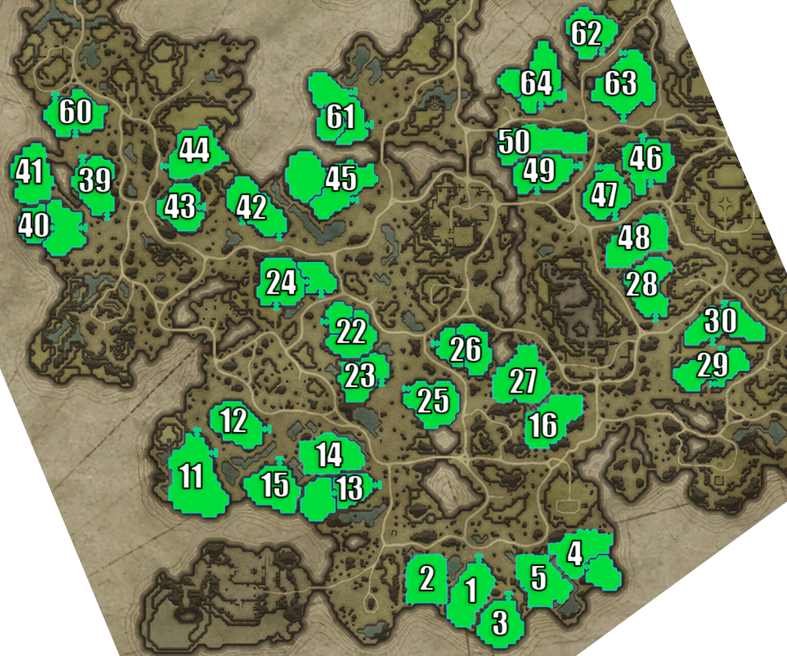

## Farbane West

> Individual plot images below are from: https://www.cadrift.net/v-rising/territories/

## Plot 1[^1]

- narrow stairs entrance in north
- open side in east
- heart at west
  - 10-doors deep from stairs entrance
  - 9-doors deep from the open side in east
  - 2-doors deep from Plot 2
- jumpable: Plot 2 and Plot 3

## Plot 2

- too open
- jumpable: Plot 1

## Plot 3[^1]

- narrow stairs entrance
- 12-doors deep
- 4-doors deep from Plot 1
- jumpable: Plot 1

## Plot 4[^1]

- narrow stairs entrance if defense starts at 2nd level
- 9-doors deep
- jumpable: Plot 5

## Plot 5

- too open
- can jump from west mountains
- jumpable: Plot 4

## Plot 11[^1]

- narrow stairs entrance in north
- narrow stairs entrance in east
- servants can be placed to cover all entrances
- 17-doors deep from east
- 20-doors deep from north
- double entrance but close enough for servants to defend both
- can bat land on the mountains in the northwest

## Plot 12

- narrow stairs entrance
- 13-doors deep
- 99% secure

## Plot 13

- narrow stairs entrance in east
- 20-doors deep from entrance
- 2-doors deep from Plot 15
- 10-doors deep from Plot 14
- jumpable: Plot 14 and plot 15

## Plot 14

- too open
- jumpable: Plot 13

## Plot 15[^1]

- narrow stairs entrance in north
- 11-doors deep
- 9-doors deep from Plot 13
- jumpable: Plot 13

## Plot 16

- too open
- jumpable: Plot 27
- can jump from rock at northwest
- great temporary plot to quickly make gravedigger ring or smelt copper ores

## Plot 22

- narrow stairs entrance
- 20-doors deep from west
- 6-doors deep from Plot 23
- jumpable: Plot 23

## Plot 23[^1]

- narrow stairs entrance
- 13-doors deep
- 8-doors deep from Plot 22
- jumpable: Plot 22

## Plot 24[^1]

- narrow stairs entrance in southwest
- narrow stairs entrance in southeast
- 11-doors deep from southwest
- 12-doors deep from southeast
- can frog jump from stairs outside of the castle on the west
- can leap from plateau on the east

## Plot 25[^1]

- narrow stairs entrance
- 13-doors deep
- can leap from a plateau in the south

## Plot 26

- narrow stairs entrance
- 18-doors deep
- jumpable: Plot 27

## Plot 27

- too open
- jumpable: Plot 16

## Plot 28[^1]

- narrow stairs entrance
- 15-doors deep
- 2-doors deep from Plot 48
- jumpable: Plot 48
- can bat land to the east of the plateau
- can parkour with key all the way to northeast of the plateau

## Plot 29[^1]

- narrow stairs entrance in north
- narrow stairs entrance in south
- servants can be placed to cover all entrances
- 15-doors deep from north
- 10-doors deep from south
- 6-doors deep after frog jump in a corner near the heart
- jumpable: Plot 30

## Plot 30[^1]

- narrow stairs entrance in north
- narrow stairs entrance in south
- servants can be placed to cover all entrances
- 12-doors deep from north
- 12-doors deep from south
- 6-doors deep from a frog jump in a corner near the heart
- jumpable: Plot 30

## Plot 39[^1]

- narrow stairs entrance in north
- narrow stairs entrance in south
- 8-doors deep from north
- 7-doors deep from south
- can leap into plot via Plot 40

## Plot 40

- narrow stairs entrance
- 15-doors deep
- 6-doors deep from Plot 41
- can leap into plot via Plot 39
- jumpable: Plot 41

## Plot 41[^1]

- bridge entrance in northeast
- south-southeast is open
- 8-doors deep from bridge
- 12-doors deep from southeast
- 10-doors deep from south
- jumpable: Plot 40

## Plot 42[^1]

- narrow stairs entrance in southwest
- narrow stairs entrance in southeast
- 7-doors deep from southwest
- 18-doors deep from southeast
- 9-doors deep via west plateau
- can jump from west plateau

## Plot 43[^1]

- narrow stairs entrance
- 8-doors deep
- 7-doors deep from Plot 44
- jumpable: Plot 44

## Plot 44[^1]

- narrow stairs entrance in west
- open area in south
- servants can be placed to cover all entrances
- 16-doors deep from west
- 12-doors deep from south
- jumpable: Plot 43

## Plot 45

- narrow stairs entrance
- 22-doors deep
- 99% secure

## Plot 46[^1]

- narrow stairs entrance from north
- narrow stairs entrance from south
- open area in west
- 7-doors deep from north
- 8-doors deep from south
- 13-doors deep from west
- can jump in northeast
- can bat land in northwest area of the plot
- can bat land in northwest plateau
- jumpable: Plot 47

## Plot 47[^1]

- narrow stairs entrance from north
- narrow stairs entrance from south
- open area in east
- 10-doors deep from north
- 8-doors deep from south
- 13-doors deep from east
- can bat land in north plateau
- jumpable: Plot 46

## Plot 48

- too open
- can jump on the half-height rocks surrounding the plot
- jumpable: Plot 28

## Plot 49[^1]

- narrow stairs entrance in south
- narrow stairs entrance in east
- 8-doors deep from south
- 12-doors deep from south
- 3-doors deep from Plot 50
- jumpable: Plot 50

## Plot 50

- too open
- jumpable: Plot 49

## Plot 60[^1]

- narrow stairs entrance in northwest
- narrow stairs entrance in south
- 9-doors deep from northwest
- 9-doors deep from south
- 99% secure

## Plot 61[^1]

- narrow stairs entrance in southeast
- narrow stairs entrance in northeast
- 10-doors deep from southeast
- 10-doors deep from northeast
- 99% secure

## Plot 62[^1]

- narrow stairs entrance
- 11-doors deep
- can bat land on the mountains in the northeast
- can jump into plot all the way from [Plot 78](dunley.md#plot-78)

## Plot 63[^1]

- narrow stairs entrance in north
- narrow stairs entrance in south
- 11-doors deep from north
- 12-doors deep from south
- can jump from west bridge to plot
- can leap into plot from east plateau
- great temporary plot to watch over Quincey and depot iron ores

## Plot 64[^1]

- narrow stairs entrance in south
- wide stairs entrance in east
- can place servants to cover all entrances
- 14-doors deep from south
- 14-doors deep from east
- 99% secure

## Plot Directory

- [Terms](../146-plots-analysis.md#terms)
- [Go here for plots in Farbane West](farbane-west.md)
- [Go here for plots in Farbane East](farbane-east.md)
- [Go here for plots in Dunley Farmlands](dunley.md)
- [Go here for plots in Hallowed Mountains](hallowed.md)
- [Go here for plots in Silverlight Hills](silverlight.md)
- [Go here for plots in Cursed Forest](cursed.md)
- [Go here for plots in Gloomrot](gloomrot.md)
- [Go here for plots in Oakveil](oakveil.md)

[^1]: castle depth is estimated. It usually goes down by 2-5 after adding banshees room and servants room.

---

[Back to Home](../../README.md)
