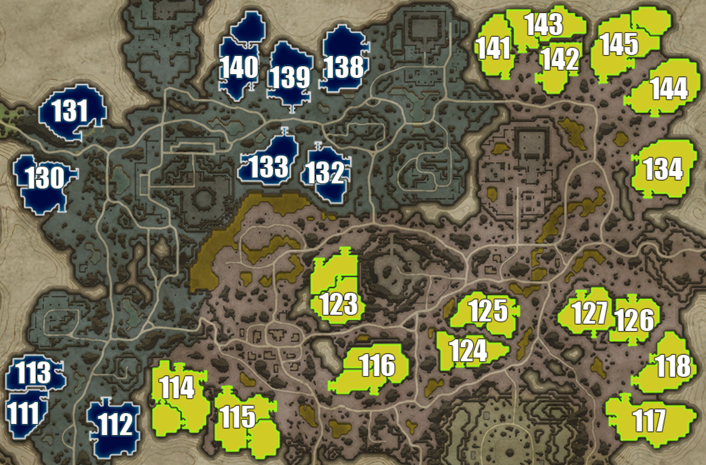

## Gloomrot

> Individual plot images below are from: https://www.cadrift.net/v-rising/territories/

## Plot 111[^1]

- wide stairs entrance
- 14-doors deep
- jumpable: Plot 113
- pair with Plot 113

## Plot 112[^1]

- narrow stairs entrance in north
- narrow stairs entrance in west
- can place servants to cover all entrances
- 15-doors deep from north
- 11-doors deep from west
- 99% secure

## Plot 113[^1]

- wide stairs entrance in east
- whole south side is open
- 10-doors deep from east
- 8-doors deep from south
- can jump from charging station area in north
- jumpable: Plot 111
- pair with Plot 111

## Plot 114

- wide stairs entrance in north
- wide stairs entrance in northeast
- can place servants to cover all entrances
- 20-doors deep from north
- jumpable: Plot 115
- can bat land inside the plot in the west side (beside the stairs)
- can leap inside the plot in the west side (beside the stairs) from Plot 112
- can jump on the ledges besdide the northeast stairs
- can jump on the ledges on the mountains in the northwest

## Plot 115

- wide stairs entrance in east
- wide stairs entrance in north
- 30-doors deep from east
- 28-doors deep from north
- jumpable: Plot 115
- can bat land on the mountains in the east
- can jump on the ledges beside both entrances

## Plot 116

- narrow stairs entrance if you start at 2nd level
- 12-doors deep
- 99% secure

## Plot 117

- wide stairs entrance in north
- wide stairs entrance in west
- can place servants to cover all entrances
- 21-doors deep from north
- 21-doors deep from west
- can leap into plot via Plot 118

## Plot 118[^1]

- wide stairs entrance in west
- wide stairs entrance in southwest
- 11-doors deep from west
- 10-doors deep from southwest
- can leap into plot via Plot 117

## Plot 123

- narrow stairs entrance if you start at 2nd level
- 14-doors deep
- 99% secure

## Plot 124[^1]

- wide stairs entrance
- 11-doors deep
- 2-doors deep from Plot 125
- can leap into plot via Plot 125

## Plot 125

- wide stairs entrance
- 15-doors deep
- can leap into plot via Plot 124

## Plot 126[^1]

- wide stairs entrance in north
- wide stairs entrance in south
- 7-doors deep from north
- 7-doors deep from south
- jumpable: Plot 127
- can jump to plot from the south entrance of Plot 127
- can bat land on the whole west side of the plot

## Plot 127[^1]

- wide stairs entrance in north
- narrow stairs entrance in south
- 9-doors deep from north
- 8-doors deep from south
- jumpable: Plot 126

## Plot 130

- wide stairs entrance in northeast
- wide stairs entrance in southeast
- 16-doors deep from northeast
- 22-doors deep from southeast
- 99% secure

## Plot 131[^1]

- wide stairs entrance in southeast
- wide stairs entrance in south
- 14-doors deep from southeast
- 11-doors deep from south
- 99% secure

## Plot 132[^1]

- single entrance in north
- wide entrance in east
- 14-doors deep from north
- 11-doors deep from east
- can leap into plot via Plot 133

## Plot 133[^1]

- narrow stairs entrance in north
- wide stairs entrance in west
- 11-doors deep from north
- 13-doors deep from west
- 3-doors deep from Plot 132
- can leap into plot via Plot 132

## Plot 134[^1]

- narrow stairs entrance in west
- wide stairs entrance in south
- can place servants to cover all entrances
- 14-doors deep from west
- 14-doors deep from south
- 99% secure

## Plot 138[^1]

- wide stairs entrance in northeast
- wide stairs entrance in southwest
- 9-doors deep from northeast
- 12-doors deep from southwest
- can leap into plot via Plot 139

## Plot 139[^1]

- wide stairs entrance in southeast
- wide stairs entrance in southwest
- narrow stairs entrance in south
- can place servants to cover southeast, southwest and south entrances
- open area in entrance in west
- 10-doors deep from all south entrances
- 12-doors deep from west
- 4-doors deep from Plot 138
- can leap into plot via Plot 138
- can leap into plot via Plot 140

## Plot 140[^1]

- narrow stairs entrance if you start at 2nd level
- 8-doors deep
- 99% secure

## Plot 141[^1]

- wide stairs entrance in south
- whole east side is open
- 12-doors deep from south
- 9-doors deep from east
- jumpable: Plot 143
- can leap from the power plant in the west to plot on multiple edges

## Plot 142[^1]

- wide stairs entrance in east
- wide stairs entrance in west
- 9-doors deep from east
- 9-doors deep from west
- 2-doors deep from north
- jumpable: Plot 143
- can leap into plot via Plot 145
- can jump on the northwest edge of the plot

## Plot 143

- wide stairs entrance
- 21-doors deep
- 8-doors deep from Plot 142
- jumpable: Plot 141 and Plot 142

## Plot 144[^1]

- wide stairs entrance in west
- wide stairs entrance in south
- can place servants to cover all entrances
- 24-doors deep from west
- 20-doors deep from south
- 99% secure

## Plot 145

- wide stairs entrance in south
- wide stairs entrance in southeast
- can place servants to cover all entrances
- 29-doors deep from south
- 29-doors deep from southeast
- can leap into plot via Plot 142

## Plot Directory

- [Terms](../146-plots-analysis.md#terms)
- [Go here for plots in Farbane West](farbane-west.md)
- [Go here for plots in Farbane East](farbane-east.md)
- [Go here for plots in Dunley Farmlands](dunley.md)
- [Go here for plots in Hallowed Mountains](hallowed.md)
- [Go here for plots in Silverlight Hills](silverlight.md)
- [Go here for plots in Cursed Forest](cursed.md)
- [Go here for plots in Gloomrot](gloomrot.md)
- [Go here for plots in Oakveil](oakveil.md)

[^1]: castle depth is estimated. It usually goes down by 2-5 after adding banshees room and servants room.

---

[Back to Home](../../README.md)
