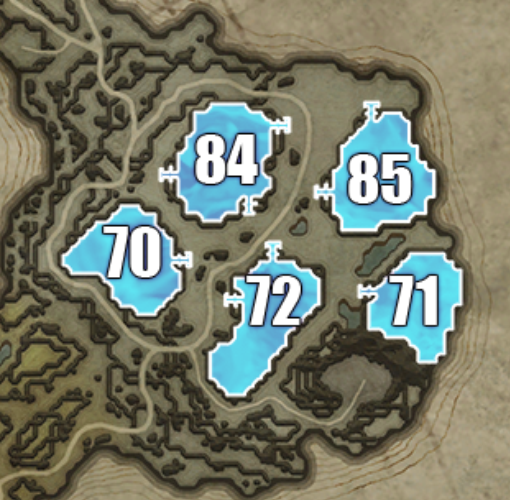

## Hallowed Mountains

> Individual plot images below are from: https://www.cadrift.net/v-rising/territories/

## Plot 70

- narrow stairs entrance
- 11-doors deep
- 99% secure

## Plot 71

- narrow stairs entrance
- 12-doors deep
- 99% secure

## Plot 72[^1]

- narrow stairs entrance in west
- narrow stairs entrance in north
- can place servants to cover all entrances
- 13-doors deep from west
- 17-doors deep from north
- can jump from west entrance to a deeper corner of the castle

## Plot 84[^1]

- narrow stairs entrance in northeast
- narrow stairs entrance in south
- narrow stairs entrance in west
- 7-doors deep from northeast
- 7-doors deep from south
- 6-doors deep from west
- every stairs has a side area that can be jumped on
- can jump on the half-height corner of the plot in east
- can jump on the half-height corner of the plot in northeast

## Plot 85[^1]

- narrow stairs entrance in north
- narrow stairs entrance in southwest
- 13-doors deep from north
- 10-doors deep from southwest
- every stairs has a side area that can be jumped on
- can jump on the half-height corner of the plot in northwest

## Plot Directory

- [Terms](../146-plots-analysis.md#terms)
- [Go here for plots in Farbane West](farbane-west.md)
- [Go here for plots in Farbane East](farbane-east.md)
- [Go here for plots in Dunley Farmlands](dunley.md)
- [Go here for plots in Hallowed Mountains](hallowed.md)
- [Go here for plots in Silverlight Hills](silverlight.md)
- [Go here for plots in Cursed Forest](cursed.md)
- [Go here for plots in Gloomrot](gloomrot.md)
- [Go here for plots in Oakveil](oakveil.md)

[^1]: castle depth is estimated. It usually goes down by 2-5 after adding banshees room and servants room.

---

[Back to Home](../../README.md)
