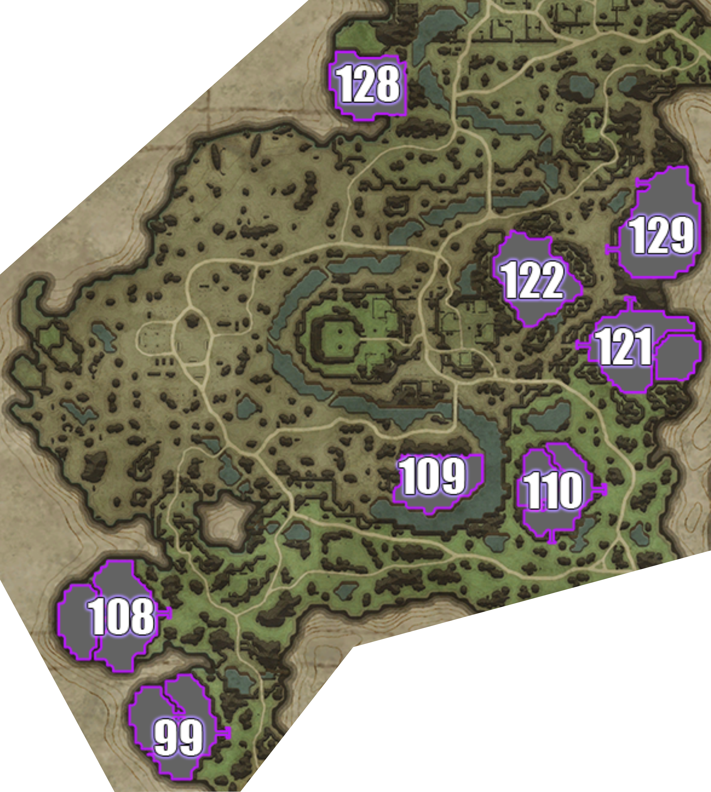

## Oakveil

> Individual plot images below are from: https://www.cadrift.net/v-rising/territories/

## Plot 99

- narrow stairs entrance
- 18-doors deep
- 99% secure

## Plot 108

- narrow stairs entrance
- 16-doors deep
- can bat land on the corner in the north middle of the plot

## Plot 109

- too open

## Plot 110[^1]

- narrow stairs entrance in east
- narrow stairs entrance in south
- 12-doors deep from east
- 13-doors deep from south
- can bat land on the corner in the north side of the plot
- great temporary plot if you want to cheese Jakira at the start of the server

## Plot 121[^1]

- narrow stairs entrance if you start at 2nd level
- 7-doors deep
- can bat land on the south mountains

## Plot 122

- too open
- can bat land on one of the rocks in the northeast
- can jump to the edge of the mixing outpost on the west

## Plot 128

- too open
- can leap from other side of cliff in south

## Plot 129[^1]

- narrow stairs entrance in northwest
- narrow stairs entrance in southwest
- 14-doors deep from northwest
- 12-doors deep from southwest
- can jump from the ledge beside the southwest stairs

## Plot Directory

- [Terms](../146-plots-analysis.md#terms)
- [Go here for plots in Farbane West](farbane-west.md)
- [Go here for plots in Farbane East](farbane-east.md)
- [Go here for plots in Dunley Farmlands](dunley.md)
- [Go here for plots in Hallowed Mountains](hallowed.md)
- [Go here for plots in Silverlight Hills](silverlight.md)
- [Go here for plots in Cursed Forest](cursed.md)
- [Go here for plots in Gloomrot](gloomrot.md)
- [Go here for plots in Oakveil](oakveil.md)

[^1]: castle depth is estimated. It usually goes down by 2-5 after adding banshees room and servants room.

---

[Back to Home](../../README.md)
