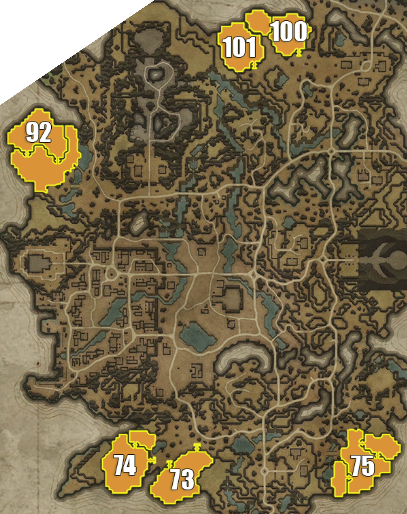

## Silverlight Hills

> Individual plot images below are from: https://www.cadrift.net/v-rising/territories/

## Plot 73[^1]

- narrow stairs entrance in northeast
- narrow stairs entrance in northwest
- 21-doors deep from northeast
- 9-doors deep from northwest
- can bat land inside the mountains on the east
- can leap into plot via Plot 74

## Plot 74

- narrow stairs entrance in north
- narrow stairs entrance in east
- can place servants to cover all entrances
- 11-doors deep from north
- 13-doors deep from east
- can leap into plot via Plot 73

## Plot 75[^1]

- narrow stairs entrance in northwest
- open area in northwest
- open area in west (2nd level)
- 14-doors deep from stairs in northwest
- 13-doors deep from open area in northwest
- 19-doors deep from open area in west
- can jump to the west area via the army outpost

## Plot 92[^1]

- narrow stairs entrance in southeast
- narrow stairs entrance in southwest
- 15-doors deep from southeast
- 12-doors deep from southwest
- can bat land on the mountains in the south

## Plot 100

- narrow stairs entrance
- 22-doors deep
- 3-doors deep from Plot 101
- jumpable: Plot 101

## Plot 101[^1]

- narrow stairs entrance
- 16-doors deep
- 11-doors deep from Plot 100
- jumpable: Plot 100

## Plot Directory

- [Terms](../146-plots-analysis.md#terms)
- [Go here for plots in Farbane West](farbane-west.md)
- [Go here for plots in Farbane East](farbane-east.md)
- [Go here for plots in Dunley Farmlands](dunley.md)
- [Go here for plots in Hallowed Mountains](hallowed.md)
- [Go here for plots in Silverlight Hills](silverlight.md)
- [Go here for plots in Cursed Forest](cursed.md)
- [Go here for plots in Gloomrot](gloomrot.md)
- [Go here for plots in Oakveil](oakveil.md)

[^1]: castle depth is estimated. It usually goes down by 2-5 after adding banshees room and servants room.

---

[Back to Home](../../README.md)
